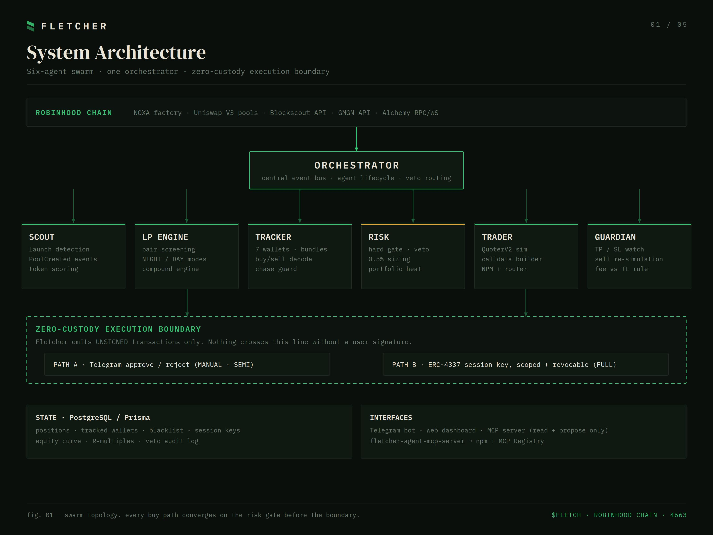
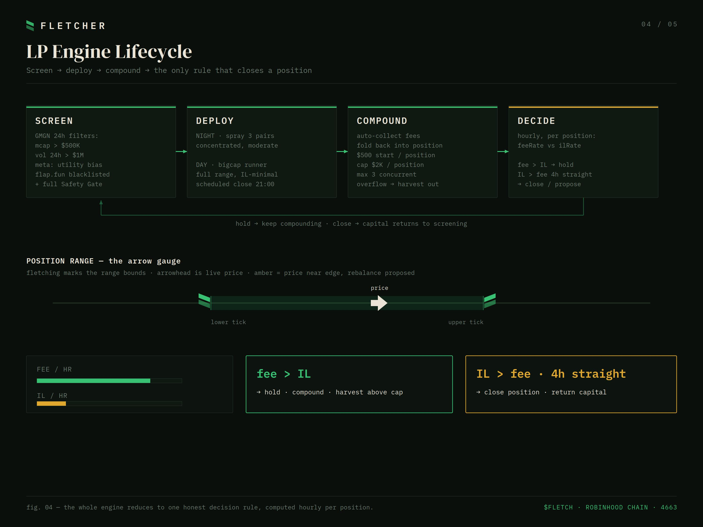
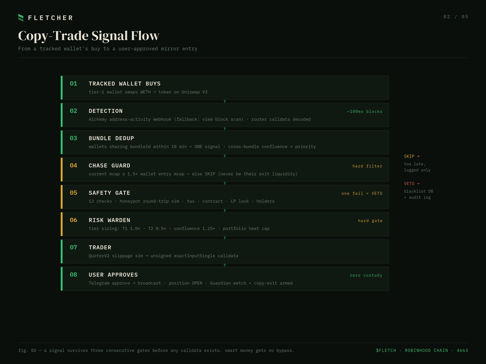
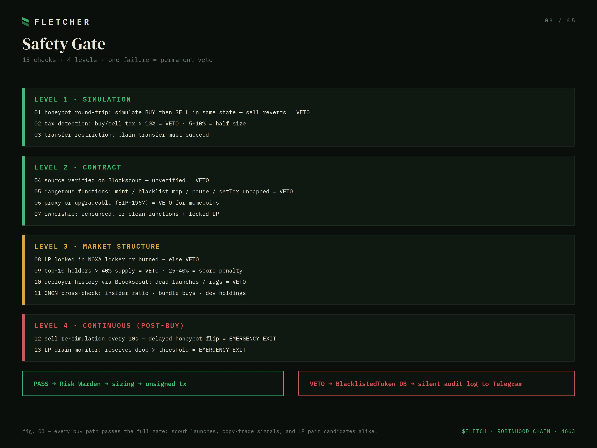
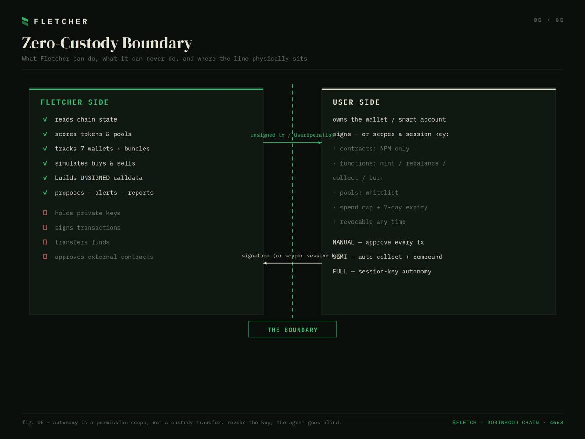

<div align="center">

# FLETCHER

**Autonomous Liquidity & Trading Swarm for Robinhood Chain**

*Screen the meta. Deploy the range. Compound the fees. Never hold the keys.*

[](https://robinhoodchain.blockscout.com)
[](#tech-stack)
[](#the-zero-custody-boundary)
[](#mcp-server)
[](https://x.com/fletcheragt)

</div>

---

Fletcher is a six-agent swarm that manages concentrated liquidity positions, snipes NOXA launches, and mirrors smart-money wallets on Robinhood Chain — while emitting **unsigned transactions only**. Your keys never leave your hands.

A fletcher is the craftsman who makes arrows. This agent makes yours: it forges the signal and the calldata, but you decide when to loose it.

## Why Robinhood Chain

Robinhood Chain (Arbitrum Orbit, ~100ms blocks, Uniswap V3 live day one) launched its public mainnet in July 2026. Liquidity supply is still thin while volume is not — which makes disciplined, automated LP management the most underserved edge on the chain. Fletcher is built to capture exactly that window, with a trench engine and copy-trading layer riding on top.

---

## Architecture

The swarm: six specialized agents behind one orchestrator, all converging on a single hard risk gate before anything reaches the execution boundary.



| Agent | Role |
|---|---|
| **Scout** | Real-time launch detection — NOXA factory & Uniswap V3 `PoolCreated` events, token scoring via Blockscout |
| **LP Engine** | Pair screening, NIGHT/DAY deployment modes, compound engine, fee-vs-IL decision loop |
| **Tracker** | Smart-money wallet surveillance, buy/sell calldata decoding, bundle dedup, chase guard |
| **Risk Warden** | The hard gate — fixed-fractional sizing, portfolio heat cap, veto authority over every agent |
| **Trader** | QuoterV2 slippage simulation, unsigned calldata assembly (swap router + NonfungiblePositionManager) |
| **Guardian** | Post-entry watch — TP/SL, continuous sell re-simulation, LP drain monitor, fee-vs-IL rule |

No agent can bypass another's gate. The orchestrator routes signals; the Risk Warden can kill any of them.

---

## LP Engine — the core utility

Fletcher's main job is running concentrated liquidity like a desk would: screen candidates quantitatively, deploy in one of two modes, compound relentlessly, and hold or close on a single honest rule.



**Screening** (GMGN API, 24h timeframe): mcap > $500K, volume > $1M, utility-meta bias, launchpad blacklist, full Safety Gate pass. All thresholds live in an editable `metaConfig` — the meta rotates, the code shouldn't have to.

**Two deployment modes:**
- `NIGHT` — spray up to 3 concentrated positions overnight, auto-collect and report at morning
- `DAY` — full-range LP on the daily bigcap runner, IL-minimal, scheduled close

**Compounding:** $500 per position, fees fold back in until the $2K/position cap, max 3 concurrent. Overflow is harvested out as realized profit — never redeployed past the cap.

**The only close rule:** computed hourly, per position:

```
fee rate  >  IL rate            →  hold, compound
IL rate   >  fee rate  (4h+)    →  close, return capital to screening
```

That's the whole decision. If fees outrun impermanent loss, the position lives. When they don't, it dies. No vibes.

---

## Copy-Trade Protocol

Fletcher tracks a curated registry of smart-money wallets (grouped into bundles to prevent one entity counting as multiple signals) and mirrors their entries — but only when the mirror still makes sense.



Three consecutive gates stand between a tracked wallet's buy and your calldata:

1. **Chase Guard** — copy only if current mcap ≤ 1.5× the wallet's entry mcap. Arriving late means becoming their exit liquidity. Skip.
2. **Safety Gate** — the full 13-check screen. Smart money buys honeypots too. No VIP lane.
3. **Risk Warden** — tier-based sizing (Tier 1 full / Tier 2 half / probation paper-only), portfolio heat cap.

Wallets earn their tier: performance tracking per wallet with automatic demotion (low win-rate, rug streaks, copytrader-farming patterns) and promotion. Copy-exit optionally mirrors the source wallet's sell so you leave when they do.

---

## Safety Gate

Every buy path — scout launch, copy signal, or LP pair candidate — passes the same 13 checks across 4 levels. One failure is a permanent veto and a blacklist entry.



The two that matter most:

- **Honeypot round-trip simulation** — before any calldata exists, Fletcher simulates a buy *and* the corresponding sell in the same state. A token you can buy but not sell never gets past level 1.
- **Continuous sell re-simulation** — modern honeypots flip *after* launch. The Guardian re-simulates the sell path on every open position every 10 seconds. The moment a sell starts reverting or slippage spikes abnormally, an emergency exit fires ahead of any TP/SL.

---

## The Zero-Custody Boundary

Fletcher is autonomous in decision, never in custody. The boundary is physical: nothing crosses it without a user signature.



Three autonomy modes:

| Mode | Automated | Requires you |
|---|---|---|
| `MANUAL` | screening, proposals, monitoring | approve every tx in Telegram |
| `SEMI` | + fee collect & compound | approve opens and closes |
| `FULL` | all LP operations within scope | nothing — bounded by an ERC-4337 session key |

`FULL` mode uses Robinhood Chain's first-class account abstraction: you grant a **session key** scoped to the Uniswap V3 position manager only, with a function whitelist, pool whitelist, spend cap, and 7-day expiry. Fletcher can rebalance at 3am; it can never withdraw. Revoke the key, the agent goes blind.

---

## Tech Stack

- **TypeScript / Node.js** — swarm runtime
- **viem** — RPC, event watching, calldata encoding on chain 4663
- **PostgreSQL + Prisma** — positions, tracked wallets, blacklist, session keys, audit log
- **Telegraf** — Telegram approval interface & reporting
- **Blockscout API** — contract verification, deployer history, holder distribution
- **GMGN API** — market data, trending, screening filters (chain: `robinhood`)
- **Alchemy** — production RPC + address-activity webhooks

```
fletcher-core/
├── src/
│   ├── agents/          # scout · lpengine · tracker · risk · trader · guardian
│   ├── core/            # orchestrator · db
│   ├── services/        # viem · blockscout · gmgn · safetyGate
│   ├── bot/             # telegram interface
│   └── mcp/             # MCP server (read + propose only)
└── prisma/              # schema & migrations
```

## MCP Server

Fletcher ships a Model Context Protocol server so any MCP-capable AI client can read its state and propose actions — all read/propose only, consistent with the custody boundary:

- `lp_scan` — pairs currently passing the screening filters
- `lp_positions` — open positions, fee/IL status, range health
- `wallet_registry` — tracked wallets, tiers, performance stats
- `propose_entry` / `propose_rebalance` — returns unsigned transactions, never signs

## Telegram Commands

```
/lp status              open positions, fee vs IL, next actions
/lp mode manual|semi|full
/lpmeta                 edit screening meta (categories, blacklists, thresholds)
/harvest                withdraw profits above position caps
/track <address>        add wallet to registry
/wallets                registry with live stats
/copyexit on|off
/grok <token>           AI sentiment analysis for a specific token
/discover               run autonomous wallet discovery cycle
```

---

## Status

- [x] Core execution engine — scout, router execution, risk gate, Telegram approve/reject, Guardian TP/SL
- [x] Copy-trade protocol — webhook surveillance, tier system, calldata decoder, anti-farm guard
- [x] LP Engine — screening, DAY/NIGHT modes, compound engine, fee-vs-IL loop
- [x] On-chain P&L per copied wallet
- [x] ERC-4337 session keys — `FULL` autonomy
- [x] Intelligence layer — sentiment fusion, autonomous wallet discovery

## Disclaimer

Fletcher is experimental software interacting with volatile, unaudited on-chain markets. It can lose money — quickly. Nothing in this repository is financial advice. Position caps, circuit breakers, and safety checks reduce risk; they do not remove it. Use funds you can afford to lose, keep `MANUAL` mode on until you trust the system, and read the code before you run it.

## License

MIT

---

<div align="center">

**$FLETCH · Robinhood Chain · 4663**

*Autonomous liquidity, zero custody.*

</div>
